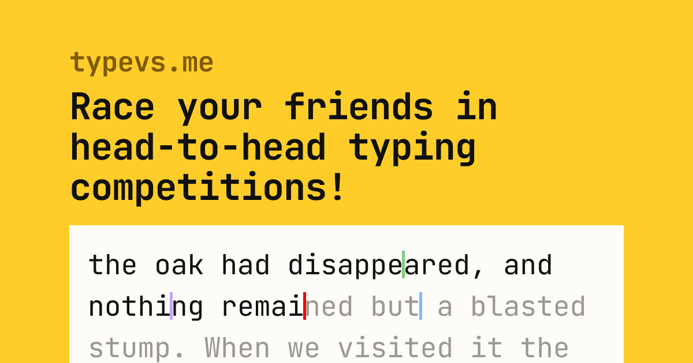

<h1 align="center">
  <a href="https://typevs.me">
    
     
    typevs.me
  </a>
</h1>

<h3 align="center">A realtime head-to-head typing competition game.</h3>

  <a href="#key-features">Key Features</a> •
  <a href="#tech-stack">Tech Stack</a> •
  <a href="#how-to-install">How to Install</a> •
  <a href="#license">License</a>

## Key Features

- Realtime typing races
- Configurable races (source of words, number of words, length)
- Accounts that track all races played
- Profile page with statistics
- A points and levels system with unlockable items
- Fine-tuned light and dark modes

## Tech Stack

| Tool                | Use                                                                                                       |
| ------------------- | --------------------------------------------------------------------------------------------------------- |
| SCSS modules        | Styling with scoped namespaces                                                                            |
| TypeScript          | Type safety                                                                                               |
| next-themes         | Persisting theming without flash of incorrect theme                                                       |
| Next.js             | Server and client-side rendering, server-side functions i.e. querying the database                        |
| Socket.io           | Two-way event-based communication between client and server, allowing updates to go from client to client |
| Node.js             | Runtime for Socket.io server                                                                              |
| Prisma ORM          | Type-safe object-relational model for querying the database & migrations                                  |
| PostgresQL          | Database for storing races, scores, users, etc.                                                           |
| Google OAuth 2.0    | Authenticating users without needing to store and maintain passwords                                      |
| Auth.js (next-auth) | Connecting OAuth and database, and providing authentication information                                   |
| Husky               | Automatically linting, formatting, and testing code on commit                                             |
| lint-staged         | Automatically linting, formatting, and testing code on commit                                             |
| ESLint              | Linting TypeScript code for errors & best practices                                                       |
| Prettier            | Formatting code                                                                                           |
| Jest                | Unit testing Socket.io server functionality                                                               |
| npm Workspaces      | Syncing Prisma client between Next.js app and Socket.io server                                            |
| Github Actions      | Automatically migrating the database when pushing new code                                                |

| Platform   | Use                                             |
| ---------- | ----------------------------------------------- |
| Vercel     | Hosting Next.js application                     |
| Render     | Hosting Socket.io server                        |
| Supabase   | Hosting PostgresQL database                     |
| GitHub     | Versioning & issue tracking                     |
| Cloudflare | Domain, DDoS protection, security               |
| Figma      | Mockups, design iterations, and system diagrams |

## How to Install

## License

MIT

---

 

Created by [Pierce Martin](https://github.com/pnm122)

(<a href="#readme-top">back to top</a>)

